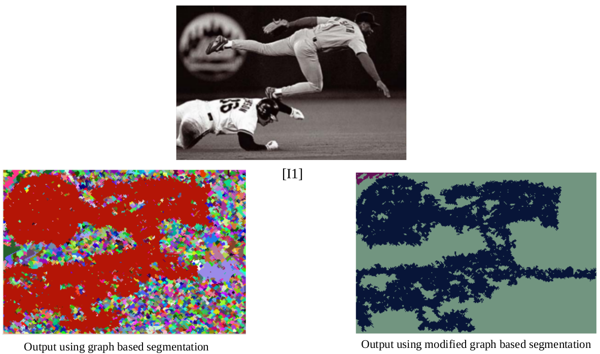
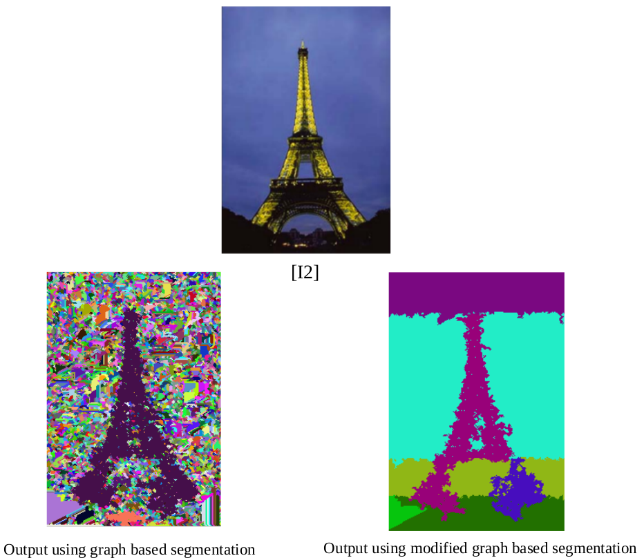
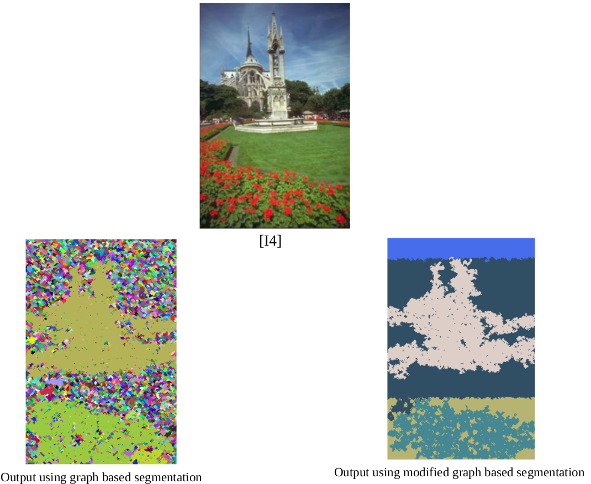

# Graph Based Image Segmentation
Classical method for image segmentation using graph based algorithm [1] implementation using python.

#### References

[1] Felzenszwalb, P.F., Huttenlocher, D.P. Efficient Graph-Based Image Segmentation. International
Journal of Computer Vision 59, 167–181 (2004).
[https://doi.org/10.1023/B:VISI.0000022288.19776.77]

[2] Uijlings, J.R.R., van de Sande, K.E.A., Gevers, T. et al. Selective Search for Object Recognition.
Int J Comput Vis 104, 154–171 (2013).
[https://doi.org/10.1007/s11263-013-0620-5]

[3] Minimum Spanning Tree Using Union Disjoint
[https://algorithms.tutorialhorizon.com/disjoint-set-union-find-algorithm-union-by-rank-and-path-
compression/]

#### Required Libraries and Tools

* opencv 3.0+
* numpy
* jupyter notebook

#### Notes

* The method proposed here for segmentation of images runs in pseudo-polynomial time.
* Current implementation in python is slow, generating result takes atleat 10-15 minutes.
* Minimum spanning tree with path compression algorithm used to implement MST
and segmentation tree.

#### Results

||
|-|
||
||
||
